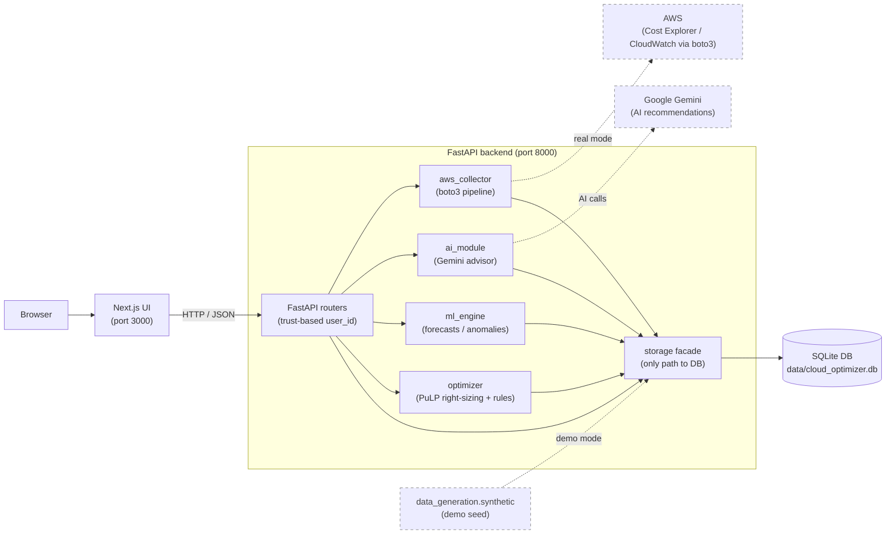
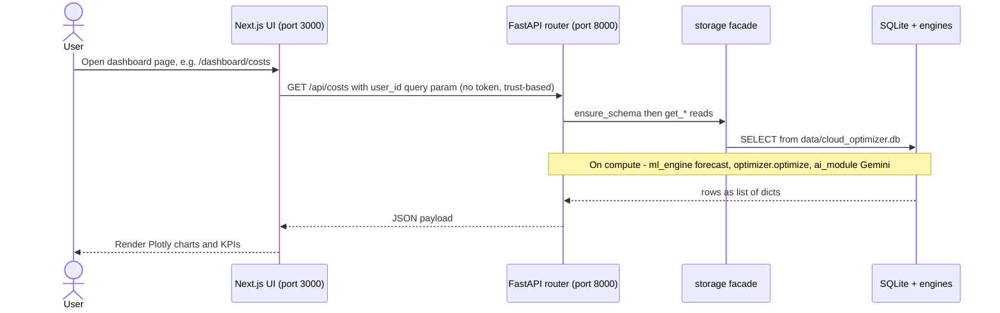
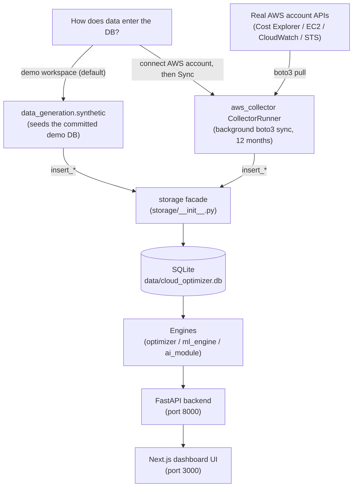

# Smart Cloud Optimizer (OptiCloud)

An AI-powered AWS cost-optimization platform: a **FastAPI** backend wrapping four engines (cost optimizer, ML forecaster, AI advisor, AWS collector) behind a **Next.js** dashboard. It collects real AWS cost/usage data (or ships synthetic demo data), forecasts spend, detects anomalies, and recommends right-sizing and pricing changes.

> **Demo Mode (default).** The app ships with a pre-loaded synthetic AWS dataset (committed in the demo DB) — no AWS credentials needed. Sign in, or click **Try Demo Mode**, to explore costs, forecasts, anomalies, and recommendations immediately. Real user accounts start with empty dashboards until an AWS account is connected from **Account Settings**.

---

## How it works

Three tiers: a browser-side **Next.js UI (:3000)** talks over HTTP/JSON to the **FastAPI backend (:8000)**. The backend's four engines and the AWS collector all read and write the SQLite database **only** through the `storage` facade.



*Browser to Next.js UI (3000) to FastAPI backend (8000), whose four engines plus aws_collector all read/write SQLite through the storage facade; AWS and Gemini are dashed optional integrations and the synthetic generator seeds the DB for demo mode.*

**Legend.** Solid arrows are in-process calls; dashed boxes/edges are optional external integrations (real AWS, Gemini, the demo seeder). The `storage` facade is the **only** component that touches the SQLite file.

When the UI opens a dashboard page, it fetches a single JSON endpoint keyed by a plain `user_id` query param (no token — see [Security Notes](#known-limitations--security-notes)):



*Runtime path of a dashboard page: browser fetch to a FastAPI router keyed by user_id, storage/engine reads from SQLite, JSON back to the Next.js UI, then Plotly charts render.*

---

## Tech stack

| Layer | Choices |
| --- | --- |
| Backend | Python 3.12, FastAPI, Uvicorn, Pydantic |
| Engines | PuLP (right-sizing LP) · Prophet / statsmodels / pmdarima (forecasts) · Google Gemini via `google-genai` (AI advisor) · boto3 (AWS collector) |
| Data | SQLite (stdlib `sqlite3`, no ORM) at `data/cloud_optimizer.db` |
| Frontend | Next.js 16 (App Router), React 19, TypeScript, Plotly, Three.js |
| Packaging | pip + `requirements.txt` (backend) · npm (frontend) · Docker Compose |

**Prerequisites:** Git, Python 3.12+, Node.js 20+, npm. *Optional:* AWS access keys for real collection; a Google Gemini API key for AI recommendations.

---

## Quick start

### Option A — Docker (simplest)

Runs the whole stack with the demo SQLite DB baked into the backend image. Defaults to demo mode with no AI key required.

```bash
docker compose up --build
```

| Service | URL |
| --- | --- |
| Frontend | http://localhost:3000 |
| Backend API docs | http://localhost:8000/docs |
| Backend health | http://localhost:8000/health |

Add the optional legacy Streamlit dashboard (the `full` profile reuses the backend image):

```bash
docker compose --profile full up --build   # adds Streamlit on http://localhost:8501
```

To set env vars (e.g. `GOOGLE_API_KEY`), copy the template and edit it:

```bash
cp .env.docker.example .env
```

Notes:
- The DB lives in a **named volume** `optimizer-data` (not a host bind mount). Reset all runtime data with `docker compose down -v`.
- `NEXT_PUBLIC_API_BASE_URL` is a frontend **build** arg (Next.js inlines it into the browser bundle), so it must be host-reachable (`http://localhost:8000`) — never the in-network service name `backend`.

### Option B — Manual (backend + frontend)

Commands below are for **macOS/Linux**. On **Windows PowerShell**, swap `source venv/bin/activate` for `.\venv\Scripts\Activate.ps1` and `cp` for `Copy-Item`.

**1. Backend** (from the repo root):

```bash
python -m venv venv
source venv/bin/activate
pip install -r requirements.txt
cp .env.example .env          # optional: only needed for AI / real AWS
uvicorn backend_api.main:app --reload --host 127.0.0.1 --port 8000
```

Backend health: http://127.0.0.1:8000/health · API docs: http://127.0.0.1:8000/docs

**2. Frontend** (second terminal):

```bash
cd frontend
npm install
cp .env.local.example .env.local
npm run dev                   # http://localhost:3000
```

> Run Python commands from the repo root with the venv active — bare `import config` / `import storage` only resolve from the root.

---

## Data & modes

Authentication options in the UI:

- **Login** — existing email + password (passwords hashed with PBKDF2-HMAC-SHA256).
- **Sign Up** — new account; password must be 8+ chars with an uppercase letter, a digit, and a symbol.
- **Try Demo Mode** — opens the synthetic `aws-SYNTHETIC-001` workspace with no registration.

The platform has two **data sources** — synthetic demo data and live AWS collection — but both write through the same `storage` facade into the same SQLite DB:



*Two data-source paths — the synthetic generator (demo) vs live boto3 collection (real connect) — both write through the storage facade into the same SQLite DB, then flow to engines and the UI.*

**Connecting a real AWS account.** From **Account Settings → Connections**, paste AWS access keys. The backend tests them via STS, stores them server-side, and (on **Sync**) launches a background thread that pulls **12 months** of cost/usage data via `aws_collector` into the DB. Data is keyed as `aws-<account_id>`; the demo user is `aws-SYNTHETIC-001`.

---

## Commands

| Task | Command |
| --- | --- |
| Run stack (Docker) | `docker compose up --build` |
| Run stack + Streamlit | `docker compose --profile full up --build` |
| Backend (dev) | `uvicorn backend_api.main:app --reload --host 127.0.0.1 --port 8000` |
| Frontend (dev) | `cd frontend && npm run dev` |
| Backend tests (all) | `python -m pytest tests/ -v` |
| Backend tests (one file) | `pytest tests/test_optimizer.py` |
| Frontend lint | `cd frontend && npm run lint` |
| Frontend build | `cd frontend && npm run build` |
| Legacy Streamlit dashboard | `streamlit run app.py` → http://localhost:8501 |
| Optimizer (CLI) | `python -m optimizer --user-id aws-SYNTHETIC-001` |
| Seed synthetic demo data | `python -m data_generation.synthetic --days 365 --user-id aws-SYNTHETIC-001` |

Notes:
- **Forecasting has no CLI.** `python -m ml_engine` is a non-functional stub (prints a notice, exits 1). Run forecasts via the dashboard Forecasts page or `GET /api/forecast`.
- The synthetic seeder is non-destructive: it overwrites the target user's rows by primary key (it never deletes other users' rows). Intended for a fresh/empty DB.

---

## Project structure

```text
smart-cloud-optimizer/
  backend_api/        FastAPI app + 8 routers (auth, connections, costs,
                      dashboard, forecast, recommendations, settings, ai-onboarding)
  frontend/           Next.js 16 app (App Router, Plotly charts, Three.js globe)
  storage/            SQLite facade — the only path to the DB (schema + data access)
  aws_collector/      boto3 collection pipeline (CollectorRunner + per-service collectors)
  ml_engine/          Forecasting (Prophet/SARIMAX/ETS/Naive) + anomaly detection
  optimizer/          Cost engine: PuLP right-sizing LP + rule-based heuristics
  ai_module/          Guided questions + Gemini recommendation generation
  dashboard/          Legacy Streamlit dashboard
  data_generation/    Deterministic synthetic-data generator + CLI
  data/               Committed demo SQLite database
  tests/              pytest suite
  config.py           Backend config + env loading (load_dotenv)
  app.py              Streamlit entry point
  docker-compose.yml  Backend + frontend (+ optional Streamlit) orchestration
  requirements.txt    Python dependencies
```

---

## Configuration

Backend env vars are resolved in `config.py`, which loads a root `.env` at import. The frontend reads a single build-time var.

| Variable | Default | Used by | Purpose |
| --- | --- | --- | --- |
| `DEMO_MODE` | `true` | legacy Streamlit dashboard | Demo status flag. The FastAPI backend does **not** branch on it — synthetic demo data ships in the committed DB and connecting a real AWS account works regardless |
| `GOOGLE_API_KEY` | *(empty)* | backend | Gemini key; AI recommendations error in-band if unset |
| `GOOGLE_MODEL` | `gemini-2.5-flash` | backend | Gemini model id |
| `AWS_REGION` | `us-east-1` | backend | Default AWS region |
| `AWS_ACCOUNT_ID` | `SYNTHETIC-001` | backend | Default account id |
| `ONBOARDING_API_TOKEN` | *(unset)* | backend | If set, `/api/ai-onboarding/generate` requires a matching `X-API-Token` header (off by default) |
| `AWS_ACCESS_KEY_ID` / `AWS_SECRET_ACCESS_KEY` / `AWS_SESSION_TOKEN` / `AWS_DEFAULT_REGION` | *(empty / `us-east-1`)* | backend (Docker) | Backend principal for `sts:AssumeRole` on real AWS connect; see `.env.docker.example` |
| `NEXT_PUBLIC_API_BASE_URL` | `http://127.0.0.1:8000` (code) / `http://localhost:8000` (build arg) | frontend | Backend base URL, inlined into the browser bundle at build time |

Templates: `.env.example` (local backend), `.env.docker.example` (Docker), `frontend/.env.local.example` (frontend).

---

## Known limitations & security notes

These are deliberate, documented limitations of the current build. The app is intended for **localhost use with synthetic data**.

- **Auth is trust-based — no tokens or sessions.** Login/sign-up verify a PBKDF2-hashed password but issue **no token or session cookie**. Every data and settings endpoint trusts a `user_id` query parameter with **no server-side authorization check**, so any client could read another user's data by supplying their `user_id`. The login route has only an in-process, per-IP throttle (10 failures / 300s → HTTP 429). This is **not safe for multi-tenant or public deployment** — a real deployment must add token/session auth and derive `user_id` server-side, and flip CORS `allow_credentials` back to `true`.
- **AWS credentials are stored in plaintext.** Connections paste AWS access keys, which are tested via STS and persisted **server-side in the SQLite DB in plaintext** (deliberate for localhost single-user use). Secrets are never returned to the client (the API exposes only the last 4 chars of the access key id) and are never re-sent during sync. Do not point this at a shared or public host with real credentials.
- **The committed demo DB contains real data.** `data/cloud_optimizer.db` ships with the synthetic demo user **plus** a real personal email (PII) and a real AWS account id / IAM role ARN in plaintext. Do not add more real account data to the committed DB.
- **AI onboarding guards.** `POST /api/ai-onboarding/generate` rejects prompts longer than 4000 characters (HTTP 400) and returns HTTP 502 when the upstream Gemini call fails (e.g. `GOOGLE_API_KEY` unset). When `ONBOARDING_API_TOKEN` is set, callers must send a matching `X-API-Token` header; it is off by default so the demo works with no token.
- **Settings are file-backed, not in the DB.** Per-user runtime settings persist to `backend_api/runtime_settings.json`. Reads are always allowed; writes/resets are read-only for demo users and for users without a connected AWS account.
- **Frontend auth is client-only.** Session identity lives entirely in browser `localStorage` — there is no Next.js middleware or server-side route protection, so any `/dashboard` route is reachable and falls back to the synthetic demo user.

---

## Git notes

Do not commit real secrets. The repo ignores `.env`, `.env.local`, virtual environments, `node_modules`, and Next.js build output. Commit these for reproducible setup:

- `requirements.txt`
- `frontend/package.json`, `frontend/package-lock.json`
- `.env.example`, `.env.docker.example`, `frontend/.env.local.example`
