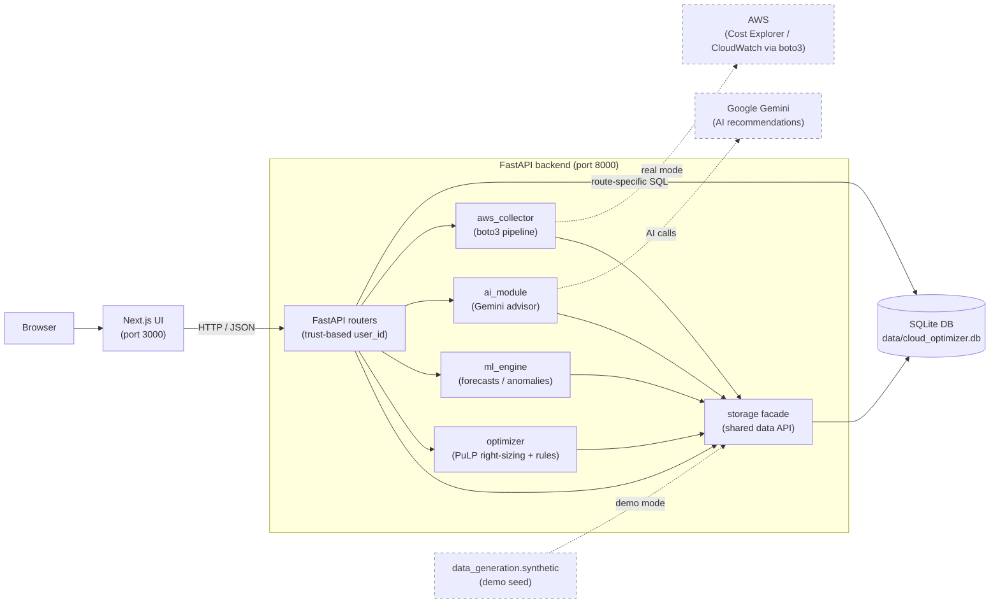

# Architecture

The application on `main` uses a TypeScript/Next.js browser UI and a Python
FastAPI backend. The optional Streamlit UI calls the Python engines directly.

## Boundaries

| Component | Responsibility |
| --- | --- |
| [`frontend/`](../../frontend/) | Next.js routes, client state, Plotly charts, HTTP calls to the backend |
| [`backend_api/`](../../backend_api/) | FastAPI routes for auth, connections/sync, costs, dashboard, forecasting, recommendations, settings, and AI onboarding |
| [`cloud_optimizer/`](../../cloud_optimizer/) | Shared Python configuration, paths, root `.env` loading |
| [`storage/`](../../storage/) | SQLite schema, migrations, authentication helpers, connection and data APIs |
| [`aws_collector/`](../../aws_collector/) | boto3 clients and per-service collectors for live AWS data |
| [`data_generation/`](../../data_generation/) | Synthetic fixtures and a CLI that seeds SQLite |
| [`ml_engine/`](../../ml_engine/) | Time-series preparation, forecasting, anomaly detection, evaluation |
| [`optimizer/`](../../optimizer/) | Inventory/metrics/pricing-based LP and rule recommendations |
| [`ai_module/`](../../ai_module/) | Questionnaire-based recommendations using Gemini |
| [`dashboard/`](../../dashboard/) | Optional legacy Streamlit application |

Use the running backend's generated http://localhost:8000/docs for HTTP contracts.
See [HTTP contracts](../api/http.md) and
[Configuration](../reference/configuration.md) for generated reference and settings.

## Persistence and computation

Most Python components access `data/cloud_optimizer.db` through `storage`.
The forecast router currently opens SQLite directly; recommendations and
connections also execute SQL on storage-created connections. The storage facade
is the preferred shared interface, but it is not an enforced access boundary.
Per-user runtime settings are stored separately; see [Runtime settings](#runtime-settings).

`ensure_schema()` creates missing tables/indexes and adds missing AWS credential
columns for older databases. `create_schema()` is destructive. See
[Storage API](../api/storage.md) for transaction ownership and
[Data schemas](data-model.md) for table details.

The optimizer reads observed inventory, metrics, and pricing; it does not consume
ML forecast output. Optimization replaces stored recommendations for the selected
user. Forecasting and Gemini recommendations are separate computations. See
[optimizer constraints and usage](engines/optimizer.md) before interpreting savings.

## Data sources

The demo workspace uses existing synthetic data in SQLite. The current tracked
generator creates fixtures for tests and demos without downloading external
research datasets. It does not reproduce the historical committed fixture
byte-for-byte.

The Next.js connection form stores access keys in SQLite; see
[connection identity and verification](#connection-identity-and-verification)
for the separate test, save, and workspace-selection behavior. The collector
supports both key-based connections and legacy IAM-role connections. Sync runs
in a background thread, clears the selected account's previous data, then
collects month ranges newest first. See [Data pipeline](data-pipeline.md) for
write behavior.

## Connection identity and verification

Registration creates a `usr-…` identity. In the primary web flow,
[the connection router](../../backend_api/routers/connections.py) saves a connection
under `aws-<account_id>`, the same workspace ID used for collected data. After
save, [the frontend session helper](../../frontend/app/lib/session.ts) switches the
stored active identity to that workspace. Web connections are not attached to
the registered `usr-…` identity. The legacy
[Streamlit settings page](../../dashboard/settings.py) instead attaches role-based
connections to its authenticated owner and selects an AWS workspace separately.

**Test connection** calls STS to resolve the supplied keys' account. Testing and
saving are separate operations: save resolves the account through STS only when
no account ID is supplied. With a supplied account ID, save validates its format
and stores the connection without rechecking the keys against that account.
A saved connection is therefore not proof of verified AWS access or ownership.
Sync creates an AWS session from the stored credentials and can fail later.

## Trust boundary

The API accepts client-supplied identity. Its `user_id` filters are not server-side
authorization. See [security boundaries](../security/README.md) for password,
credential, browser-session, and external-service limits. The
[operations guide](../operations/local-runtime.md) covers local exposure,
diagnostics, and recovery.

## Runtime settings

[backend_api/routers/settings.py](../../backend_api/routers/settings.py) stores
per-user preferences in `backend_api/runtime_settings.json`. The settings API
validates and saves them, but engines and the collector do not read that file:
saving a budget, collection interval, retention period, or model preference does
not change their current behavior. Request parameters and Python configuration
remain the active inputs.

The file is excluded from Git and the image build context. Compose persists only
`/app/data`, so settings are lost on container recreation. See
[runtime settings recovery](../operations/local-runtime.md#runtime-settings-recovery)
for file lifetime, locking limits, and corrupt-file handling.

## Engine entry points

| Subsystem | Current behavior and source |
| --- | --- |
| Collection | [Pipeline](data-pipeline.md); [`CollectorRunner`](../../aws_collector/runner.py) and [service collectors](../../aws_collector/collectors/) |
| Forecasting | [Models and evaluation](engines/forecasting.md); [`forecaster.py`](../../ml_engine/forecaster.py), [`data_prep.py`](../../ml_engine/data_prep.py), [`evaluator.py`](../../ml_engine/evaluator.py) |
| Optimization | [LP/rule contracts and usage](engines/optimizer.md); [`engine.py`](../../optimizer/engine.py) |
| AI advisor | [Questionnaire and Gemini contract](engines/ai-advisor.md); [`recommender.py`](../../ai_module/recommender.py) |
| Legacy UI | [Streamlit startup](../development/streamlit.md); [`dashboard/app.py`](../../dashboard/app.py) |

The [data model](data-model.md) explains relationships; the
[storage contract](../api/storage.md) explains transaction ownership and generated
signatures. Exact function and table inventories come from those sources.
